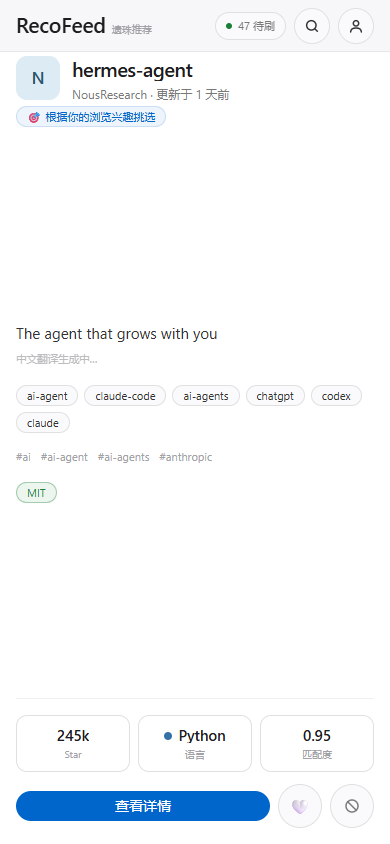
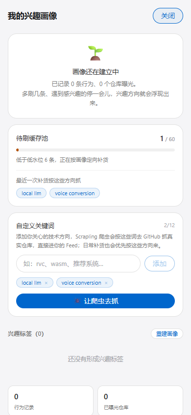
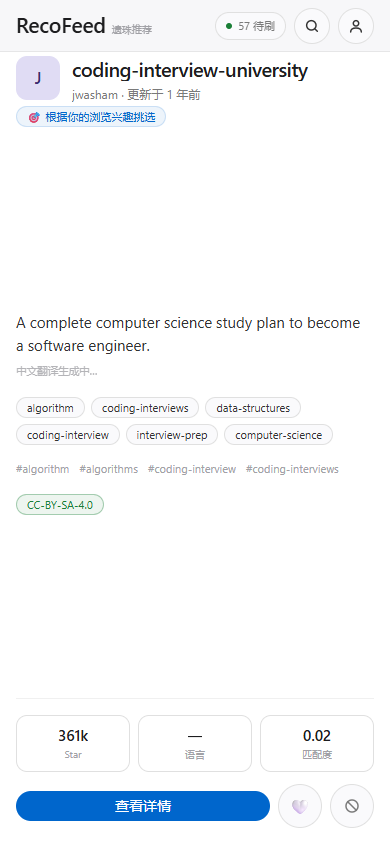

# 项目：RecoFeed

> **抖音有视频，我有仓库。**
> 让被遗忘的优质开源项目，重新被人看见。

---

## ⚠️ 本项目为开发者内部版本（Beta）

产品处于高速提交期，请勿用于有危险的地方，出现问题本项目不背任何风险。

---

## 这是什么

GitHub 从不主动推流。全世界有大量开发者写完仓库就再没推广过，优质的仓库最终因为无人访问而落灰。

RecoFeed 用**抖音的信息流范式**来做**开源仓库的发现**：

| 抖音 | RecoFeed |
|---|---|
| 视频 | GitHub 仓库 |
| 上下滑动刷 | 竖向吸附滚动（一次一张） |
| 双击点赞 | 本地点赞 |
| 收藏 | Star on GitHub |
| 停留时长 / 完播 | `dwell_ms` + `scroll_depth` 埋点 |
| 不感兴趣 | 梯度标签惩罚 |
| 推荐算法 | 多路召回 + TF-IDF 标签 + 用户画像 |
| 评论区 | Issues / PRs / Discussions → 词云 |
| 用户数据 | 完全本地，隐私自有 |

**核心理念**：商业平台让热门更热，我们要让**遗珠浮上来**。

---

## 核心特性

### 信息流
- 🎞️ **仿抖音上下滑动**：CSS `scroll-snap` 一次一张，`IntersectionObserver` 判定 active
- 🍎 **Apple 设计系统 UI**：单一 Action Blue (#0066cc) 交互色、白/羊皮纸交替满幅瓦片、SF Pro 负字距标题、胶囊按钮、唯一投影只给图像（详见 `docs/` 的设计规范）
- 🌏 **卡片即中文**：标题 + 简介自动翻译（整页合并 1 次 LLM 调用），README 支持「看原文 / 看中文」

### 推荐机制
- 🏷️ **TF-IDF 三层标签体系**：README 核心 ×1.0 / 用户足迹 ×0.6 / Issue 词云 ×0.3
- 👤 **多层用户画像**：能力圈（自建仓库）×1.0 / 兴趣圈（Star）×0.6 / 注意力圈（完读）×0.3
- ⭐ **GitHub 实证圈（最强信号）**：见下节 —— 登录后拉取你**自己做的仓库**与**点星的仓库**
- 🧊 **缓存池 + 定向补货**：Feed 先读队列；水位低时按画像决定「抓什么」，而不是无脑抓 trending
- 🔍 **搜索干预**：搜索词作临时标签，4:1 混合，5 次刷新后归零
- 👎 **梯度负反馈**：区分「讨厌这个仓库」与「讨厌这个类别」
- 🌱 **渐进式冷启动**：Trending 诱饵 → 70/30 混合 → 纯算法
- 💎 **遗珠标记**：低曝光 + 高口碑的仓库会被打上「💎 遗珠」并优先获得曝光

### 数据获取
- 🕷️ **Scrapling 爬虫**：用户在画像面板自建关键词 → 一键去 GitHub 抓真实仓库 → 入库 → 直接入队
- 🔄 **真实数据种子**：`jobs/seed_real.py` 从 GitHub Search API 拉取真实仓库重灌数据库
- 🔒 **本地优先**：数据存本地 SQLite，隐私自有

---

## GitHub 实证圈：最强的兴趣信号

「刷到卡片停了一会儿」只是弱证据。**你亲手在写的仓库**才是铁证。

登录 GitHub 后，RecoFeed 会拉取两类数据并赋予权重（数值可调，见 `backend/core/config.py`）：

| 来源 | 判据 | 权重 |
|---|---|---|
| **自建仓库** | 最近推送 ≤7 天 | **0.50** |
| | ≤30 天 | 0.20 |
| | ≤90 天 / ≤180 天 / ≤1 年 / 更久 | 0.12 / 0.08 / 0.05 / 0.03 |
| **点星仓库** | 按仓库星数排名第 1 | **0.40** |
| | 第 10 名 / 第 20 名 | 0.30 / 0.20 |
| | 第 50 / 100 / 300 名 | 0.12 / 0.08 / 0.05 |

- **自建仓库整体高于点星仓库**（0.5 > 0.4）—— 用户亲手做的东西优先
- 进入画像时整体乘 `GITHUB_SIGNAL_BOOST = 2.0`（"猛推"的量化开关）
- 这些仓库的 GitHub topics 会成为**补货方向的优先查询词**，驱动爬虫多抓同类项目

登录方式两种：① GitHub OAuth 授权（需自建 OAuth App，见下）；② **个人访问令牌直连**（登录页粘贴即可，无需建 App）。

---

## 机制有效性验证（数字人类实验）

推荐系统最容易自嗨。所以我们造了一个"数字人类"来验：

```bash
python backend/jobs/ml_simulate.py --rounds 20
```

- 给它明确的兴趣权重（声音克隆 / 本地推理 / Agent…），让它**像真人一样**决定停留时长、点赞、收藏、不感兴趣（含 8% 好奇心随机探索）
- 全程走**真实 HTTP API**，不碰内部函数
- 用 numpy 手写逻辑回归做**预测有效性**检验

**20 轮实验结果**（完整报告 → [`docs/simulation_report.md`](docs/simulation_report.md)）：

| 指标 | 结果 |
|---|---|
| 画像对齐度（系统学到的画像 vs 真实兴趣） | 0.514 → 峰值 **0.698** |
| Feed 兴趣匹配度 | 冷启动 0.103 → 峰值 **0.347**（第 11 轮） |
| 命中率（匹配度 ≥0.25 的卡片占比） | 峰值 **0.70** |
| 逻辑回归留出集 **AUC** | **0.781**（准确率 0.775） |
| 模型自学出的高权重维度 | `python` `llm` `voice` `audio` `agent` `tts` —— 正是实验设定的兴趣 |

**结论：机制有效**。同时暴露了一个真实瓶颈 —— 中后段匹配度回落，原因是**语料库只有 258 个仓库，高匹配的仓库被刷完了**；这恰好对应系统设计里的另一半（Scrapling 爬虫定向补货）。语料越大，学习曲线的高位平台越长。

---

## 技术栈

### 前端
```
React 19 + TypeScript 5.7 + Vite 6
├─ 样式      Tailwind CSS 3.4（Apple 设计系统：浅色瓷面 + 单一蓝色）
├─ 状态      React Hooks（无重型状态库）
├─ 埋点      IntersectionObserver 曝光 + dwell 深读判定
└─ 本地存储  LocalStorage（会话令牌 / 游客标记 / i18n）
```

### 后端
```
Python 3.13 + FastAPI
├─ 分词      jieba（TF-IDF / TextRank + 技术词典回填）
├─ 数据库    SQLite（WAL + busy_timeout，单文件零配置）
├─ 爬虫      Scrapling（浏览器指纹伪装，抓 GitHub）
├─ 翻译      多模型级联：OpenRouter 免费档 ×3 → DeepSeek 付费兜底
└─ 认证      GitHub OAuth / PAT + 会话表
```

---

## 快速开始

### 方式 A：Windows 一键启动（推荐）

项目根目录双击 **`start-all.bat`** —— 后端 (8000) 与前端 (5173) 各开一个独立窗口启动。
停止双击 **`stop-all.bat`**。

### 方式 B：手动启动

**后端（端口 8000）**
```bash
cd backend
python -m venv .venv
.venv\Scripts\activate            # macOS/Linux: source .venv/bin/activate
pip install -r requirements.txt

python app.py                     # → http://127.0.0.1:8000
```

**前端（端口 5173，另开终端）**
```bash
cd frontend
pnpm install
pnpm dev                          # 已配置代理：/api → http://127.0.0.1:8000
```

打开 http://localhost:5173 即可开刷。

> **数据库已随仓库提供**（`backend/data/recofeed.db`，含 **258 个真实 GitHub 仓库**）。
> 若想换一批数据：`python backend/jobs/seed_real.py --reset`（从 GitHub 实时拉取，README 走 jsdelivr CDN 补齐）。

---

## 配置

### 1. LLM（中文翻译，可选）

不配置也能跑，只是卡片不会显示中文翻译。填 `backend/core/llm_local.json`（**已 gitignore，不要提交**）：

```json
{
  "openrouter_api_key": "sk-or-v1-…",
  "deepseek_api_key": "sk-…"
}
```

级联链：OpenRouter 免费档 3 个模型 → DeepSeek 付费兜底（独立日限额 15 次，防止烧钱包）。

### 2. GitHub 登录（可选）

**方式 A：个人访问令牌（30 秒）**
GitHub → Settings → Developer settings → Personal access tokens → 勾选 `read:user` + `public_repo` → 复制令牌 → 粘贴到登录页。

**方式 B：OAuth App（正式）**
GitHub → Settings → Developer settings → **OAuth Apps → New OAuth App**：

| 字段 | 值 |
|---|---|
| Application name | `RecoFeed` |
| Homepage URL | `http://localhost:5173` |
| **Authorization callback URL** | `http://localhost:8000/api/auth/github/callback` |

把 Client ID / Client secret 填入 `backend/core/auth_local.json`（**已 gitignore**）：

```json
{
  "github_client_id": "Ov23li…",
  "github_client_secret": "…",
  "auth_secret": "换成一个随机字符串"
}
```

重启后端 → 登录页会出现「使用 GitHub 登录」按钮。

---

## 项目结构

```
RecoFeed/
├── start-all.bat / stop-all.bat      # Windows 一键启停
├── docs/
│   ├── API.md                        # ⭐ 完整 API 参考（30+ 接口）
│   ├── simulation_report.md          # ⭐ 机制有效性验证报告（自动生成）
│   ├── simulation_results.json       # 实验原始指标
│   ├── screenshots/                  # 界面截图
│   ├── schema.sql                    # 数据库 Schema（15 张表）
│   ├── 调研报告.md / .html            # 抖音等平台推流机制调研
│   ├── 推流引擎设计.md / .html         # 抖音机制 → 代码的翻译
│   └── 算法实现规格.md / .html         # 可直接编码的规格（含实测验证）
├── backend/
│   ├── app.py                        # 入口（FastAPI + 静态前端）
│   ├── core/config.py                # ⭐ 全部可调参数（限流/权重/权重公式）
│   ├── api/
│   │   ├── routes.py                 # 全部路由
│   │   ├── feed_service.py           # Feed 组装
│   │   ├── search_service.py         # 搜索（FTS5 + 个性化）
│   │   ├── crawl_service.py          # ⭐ Scrapling 关键词爬虫
│   │   ├── auth_service.py           # ⭐ GitHub OAuth / 会话 / 实证圈同步
│   │   └── translate_service.py      # 多模型级联翻译 + 缓存 + 限流
│   ├── recall/ rank/ pool/ tags/ profile/   # 召回 / 排序 / 流量池 / 标签 / 画像
│   ├── db/                           # SQLite 连接（WAL + busy_timeout）
│   ├── dict/                         # 技术词典 / 停用词 / 领域方向词
│   ├── data/recofeed.db              # ⭐ 数据集（258 个真实仓库，随仓库提供）
│   └── jobs/
│       ├── seed_real.py              # ⭐ 从 GitHub 拉真实仓库重灌
│       ├── ml_simulate.py            # ⭐ 数字人类实验（机制有效性验证）
│       ├── enrich_readme.py          # README 补齐 + 标签重提
│       └── seed_data.py / simulate.py / stress_200.py
└── frontend/
    └── src/
        ├── components/               # FeedCard / DetailSheet / ProfilePanel / LoginGate …
        ├── lib/                      # api / events / session / format
        ├── styles/index.css          # Apple 设计系统基元
        └── types/api.ts              # 与后端逐字对齐的契约类型
```

---

## 算法要点

### 推荐得分
```
推荐得分 = 预测行为概率 × 行为价值权重

行为权重：收藏(Star) > 复访 > 铁粉互动 > 5 秒完播 > 整体完播 > 评论 > 点赞 > 转发
```

### 三层标签权重
| 层级 | 数据源 | 权重 |
|---|---|---|
| 第一层 | README 项目核心 | ×1.0 |
| 第二层 | 用户 Star / 完读 | ×0.6 |
| 第三层 | Issues / PRs 热词 | ×0.3 |

### 冷启动三阶段
| 阶段 | 位置 | 策略 |
|---|---|---|
| 1 | 第 1~5 个 | 100% Trending |
| 2 | 第 6~20 个 | 70% Trending + 30% 冷门池 |
| 3 | 第 21 个起 | 100% 算法推荐 |

### 补货方向的优先级（`feed/refill.py`）
```
用户自定义关键词  >  GitHub 实证圈话题  >  高转化标签  >  画像 Top 标签  >  领域方向词
```

---

## 界面截图

| Feed（Apple 浅色瓦片） | 画像面板（含爬虫入口） | 详情页 |
|---|---|---|
|  |  |  |

| 登录页 | 游客模式 |
|---|---|
|  |  |

---

## 数据来源与合规

- 仓库元数据来自 **GitHub 官方 API**（Search API / 用户仓库 / 星标列表）
- 严格遵守 GitHub API 速率限制（令牌认证后 5000 次/小时；未认证搜索 10 次/分钟）
- README 通过 **jsdelivr CDN** 读取，减轻 GitHub 压力
- 所有推荐结果均指向 GitHub 原仓库，**不镜像、不转载仓库内容**
- 登录只请求 `read:user` 权限，**只读公开数据，不修改任何内容**
- 会话令牌与 API 密钥均只存本机（`backend/core/*_local.json` 已 gitignore）

---

## 开源协议

本项目采用 **MIT License**。

参考的第三方项目协议保持不变，详见 `THIRD_PARTY_NOTICES.md`。

---

## 贡献

见 [CONTRIBUTING.md](CONTRIBUTING.md)。

**特别欢迎**：
- 新的召回通路设计
- 中文技术标签词典扩充
- 冷启动策略优化
- 新的评估指标（欢迎扩展 `jobs/ml_simulate.py`）

---

## 致谢

灵感来自抖音推荐系统的公开机制，以及所有为解决"开源项目无人问津"问题而努力的人。
