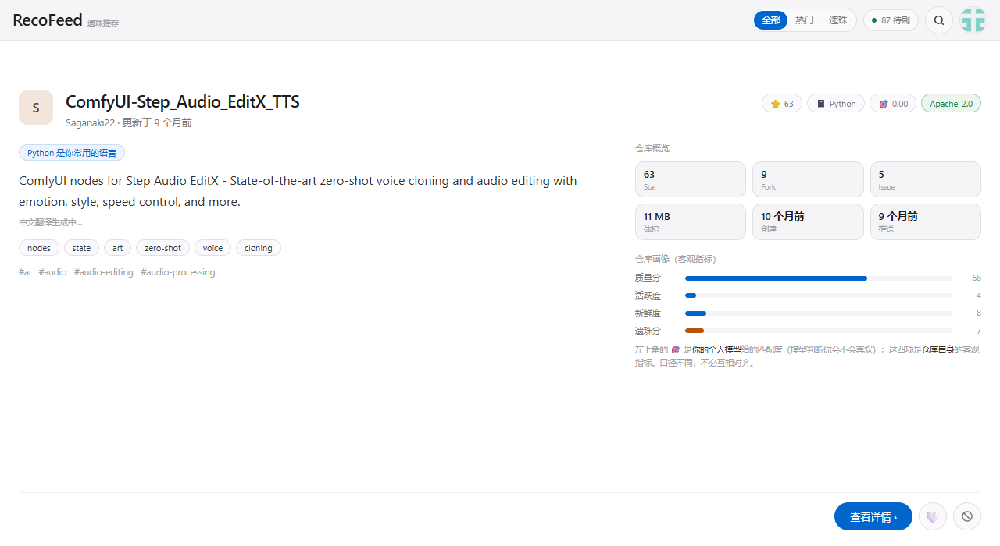
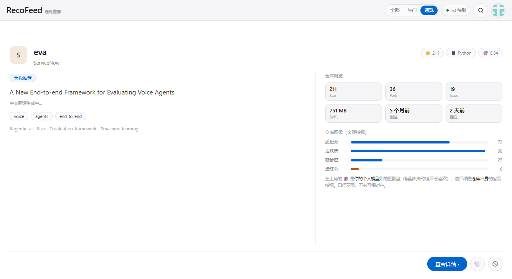
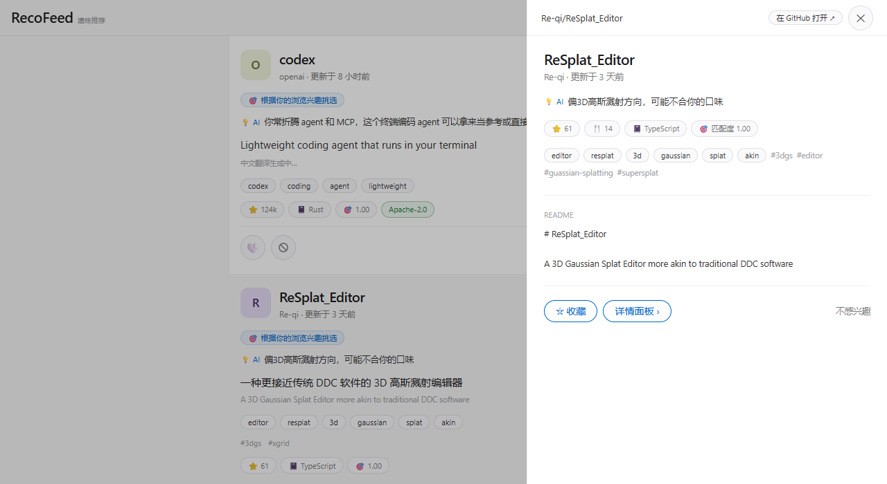
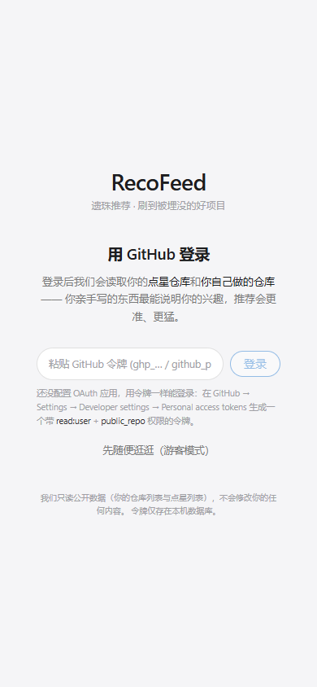
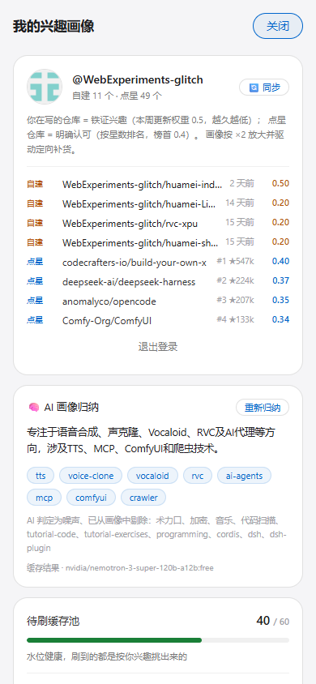
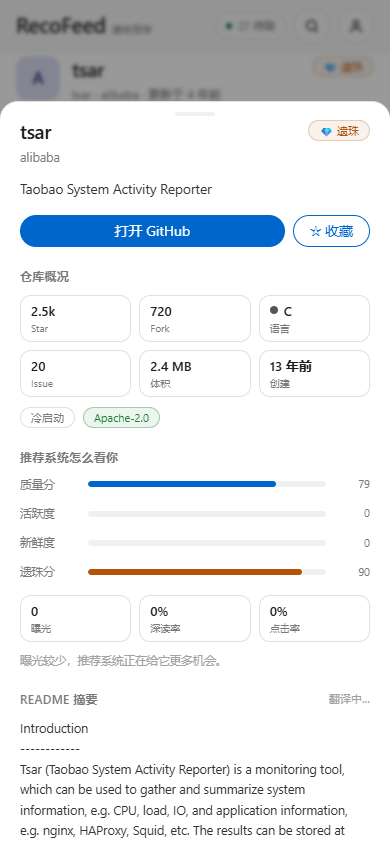

# RecoFeed · 遗珠推荐

> **抖音有视频，我有仓库。**
> 让被遗忘的优质开源项目，重新被人看见。

[](LICENSE)
[](https://www.python.org/)
[](https://react.dev/)

---

## 这是什么

GitHub 从不主动推流。全世界有大量开发者写完仓库就再没推广过，优质的仓库最终因为无人访问而落灰。

RecoFeed 用**抖音的信息流范式**来做**开源仓库的发现** —— 竖滑刷卡、停留时长作为核心信号、按兴趣投喂，但把推荐对象从"热门爆款"换成**被埋没的遗珠**。

| 抖音 | RecoFeed |
|---|---|
| 视频 | GitHub 仓库 |
| 上下滑 | 竖向吸附滚动（一屏一仓库） |
| 双击点赞 | 收藏（本地） |
| 停留时长 / 完播 | `dwell_ms` + `scroll_depth` 埋点 |
| 不感兴趣 | 梯度标签惩罚（区分"讨厌这个仓库"和"讨厌这个类别"） |
| 推荐算法 | 多路召回 + 三层标签 + **本地双塔模型** + 本地重排 |
| 评论区 | Issues / PRs / Discussions → 词云 |
| 用户数据 | 完全本地，数据不出本机 |

---

## 核心特性

### 🎞️ 一屏一仓库的信息流
- 竖向吸附滚动，卡片由内容撑开、**卡内左右两列**（文字内容 + 数据面板），桌面与移动端自适应
- 停留时长与滚动深度全量埋点 —— 它们是推荐系统最核心的输入
- **分档浏览**：全部 / **热门**（≥1000 星）/ **遗珠**（<1000 星，本项目的立身之本）

### 🗼 本地双塔推荐（你的专属微型模型）
| 组件 | 做法 | 产出 |
|---|---|---|
| 物品塔 | 本地 embedding 模型（魔搭 `BAAI/bge-small-zh-v1.5`，512 维，CPU）把全部仓库的 README 摘要 + topics + 标签向量化 | SQLite BLOB，**零外部向量库依赖** |
| 用户塔 | 自建仓库 ×0.5 + 点星 ×0.4 + 深读/点赞 ×0.3 加权聚合成用户语义向量 | 512 维用户向量 |
| 个人微调 | torch 训练 `512→128→1` MLP（CPU **0.2~0.6 秒** / 100 epoch） | `personal_model_u{id}.pth`，**仅 271 KB** |
| 本地重排 | 个人分 70% + 结构化分 30%，并设**个人分硬门槛**（低于阈值直接踢出头部） | 头部永远是"你会喜欢的"，不看星数 |

为什么这么小的模型能工作：语义理解由冻结的 embedding 承担，MLP 只学"在这个已理解语义的空间里，你的口味边界长什么样" —— 个性化所需的参数量远小于通用理解。

### 💡 LLM 解释层（大模型做小模型做不到的事）
- **推荐理由**：一页 10 张卡片**合并成 1 次调用**，生成"为什么推荐给你"，并接收个人模型打分以保持口径一致
- **画像归纳**：把标签 + 实证圈归纳成一句技术画像，并**自己揪出**残留的噪声词（写入黑名单，后续构建画像时真正剔除）
- 两者都按**画像指纹**缓存（指纹含语料规模与模型版本），画像/模型一变即自动失效

### 🏷️ 标签体系（三层权重 + 白名单闸门）
- 三层权重：README 核心 ×1.0 / 用户足迹 ×0.6 / Issues 词云 ×0.3
- **技术性白名单闸门**：英文标签必须有技术依据才保留 —— 命中技术词典 / 命中该仓库的 GitHub topics / 命中语料库自建词表（10,000+ 词）/ 具备技术形态（`gpt4`、`voice-cloning`）
- 200+ 词噪声表（README 套话 / 通用名词 / 元信息 / 中文套话），在**提取源头 + 画像 + 卡片展示**三层生效

### 🕷️ 数据获取
- **关键词爬虫**（Scrapling）：在画像面板自建关键词，一键抓真实仓库入库入队
- **批量扩库**：`jobs/seed_bulk.py` 支持 `--set main`（高星广度）与 `--set gem`（50~999 星遗珠档）
- 当前语料库：**3,616 个真实仓库**（热门 2,301 / 遗珠 1,315），随仓库提供

### 🔐 GitHub 登录与实证圈
- OAuth 授权码流 + PAT 令牌直连两种方式，会话 30 天
- 登录后拉取**自建仓库**（≤7 天推送 0.5 → 越久越低）与**点星仓库**（按星数排名 0.4~0.05），
  进入画像时整体 ×2.0 放大 —— 用户亲手做的东西必须主导推荐
- 实证仓库会**回灌语料库**（用户自己的项目与点星的项目必须可被推荐）
- 推荐时排除"已有关系"的对象：自建 / 点星 / 站内收藏 / 点赞

### 🇨🇳 中文体验
- 卡片标题 + 简介批量翻译（整页合并 1 次调用），README 支持看原文 / 看中文
- **真译文校验**：免费模型偶尔原样回吐原文，会被判为"翻译失败"，而不是把同一句话显示两遍

---

## 实测指标

| 指标 | 数值 |
|---|---|
| 个人模型留出集 AUC | **0.837**（语料 3,616、证据仓库 52） |
| 训练耗时 / 模型体积 | 0.2~0.6 秒 / 100 epoch，**271 KB** |
| 数字人类实验（20 轮真实 API 交互） | 画像对齐 0.514→0.698、命中率峰值 0.70、AUC 0.781 → [`docs/simulation_report.md`](docs/simulation_report.md) |
| 卡片标签质量 | 平均 4.2 个/仓库，65% 有 ≥3 个，无标签仅 6% |

> 数字人类实验：造一个有明确兴趣权重的"数字人类"，像真人一样决定停留/点赞/收藏，全程走真实 HTTP API，
> 再用 numpy 手写逻辑回归做预测有效性检验。**离线指标容易被小语料美化** ——
> 扩库后 AUC 曾从 0.803 掉到 0.588（负例更"像"了，任务变难），补足证据后又回到 0.837。

---

## 快速开始

### Windows 一键启动（推荐）
双击项目根目录 **`start-all.bat`** —— 后端 (8000) 与前端 (5173) 各开一个独立窗口。停止用 `stop-all.bat`。

### 手动启动
```bash
# ① 后端（端口 8000）
cd backend
python -m venv .venv
.venv\Scripts\activate            # macOS/Linux: source .venv/bin/activate
pip install -r requirements.txt

python app.py                     # → http://127.0.0.1:8000
```
```bash
# ② 前端（端口 5173，另开终端）
cd frontend
pnpm install
pnpm dev                          # → http://localhost:5173
```

**数据集已随仓库提供**（`backend/data/recofeed.seed.db`，3,616 个真实 GitHub 仓库，含向量）。
首次启动时若运行库不存在会自动从快照初始化，开箱即用。

想换一批数据：
```bash
python backend/jobs/seed_bulk.py --target 2000            # 高星广度
python backend/jobs/seed_bulk.py --set gem --target 1200  # 遗珠档（50~999 星）
python backend/jobs/retag.py                              # 重刷标签（自动更新技术词表）
```

---

## 本地模型与个性化

embedding 模型首次使用时自动从**魔搭**下载（约 180MB，缓存在 `backend/models/`，不入库）：

```bash
# 一键训练你的个人模型（向量化 → 用户塔 → 微调 → 体检）
python backend/jobs/train_personal_model.py --user <用户id>
```

训练完成后 Feed 自动启用本地重排（`meta.ml_rerank` 会透出打分与门槛统计）。

---

## 配置

### LLM（翻译 + 解释层）
填 `backend/core/llm_local.json`（**已 gitignore，请勿提交**）：
```json
{
  "openrouter_api_key": "sk-or-v1-…",
  "deepseek_api_key": "sk-…"
}
```
级联链：OpenRouter 免费档 3 个模型 → DeepSeek 付费兜底（日限额 15，防止烧钱包）。
本地限流默认**关闭**（想打开：环境变量 `RECOFEED_LLM_LIMIT=1`）；用量始终记账，`GET /api/translate/status` 可查。

### GitHub 登录
**方式 A：个人访问令牌（30 秒）** —— 登录页粘贴令牌，权限勾 `read:user` + `public_repo`。

**方式 B：OAuth App（正式）** —— GitHub → Settings → Developer settings → OAuth Apps → New OAuth App：

| 字段 | 值 |
|---|---|
| Homepage URL | `http://localhost:5173` |
| Authorization callback URL | `http://127.0.0.1:8000/api/auth/github/callback` |

把 Client ID / Secret 填入 `backend/core/auth_local.json`（**已 gitignore**）。
⚠️ 回调地址必须与上面完全一致；三个复选框都不要勾，尤其 *Expire user access tokens*（需 refresh 流程，后端未实现）。

---

## 项目结构

```
RecoFeed/
├── start-all.bat / stop-all.bat       # Windows 一键启停
├── docs/
│   ├── API.md                         # ⭐ 完整 API 参考（40+ 接口）
│   ├── simulation_report.md           # ⭐ 机制有效性验证报告（自动生成）
│   ├── screenshots/                   # 界面截图
│   ├── schema.sql                     # 数据库 Schema
│   └── 调研报告 / 推流引擎设计 / 算法实现规格（.md + .html）
├── scripts/
│   ├── export_dataset.py              # ⭐ 导出脱敏数据集快照（提交前必跑）
│   └── sanitize_dataset.py            # 原地脱敏运行库（应急）
├── backend/
│   ├── app.py                         # FastAPI 入口（含数据集自动初始化）
│   ├── core/config.py                 # ⭐ 全部可调参数（权重/限流/OAuth）
│   ├── api/
│   │   ├── routes.py                  # 全部路由
│   │   ├── feed_service.py  search_service.py
│   │   ├── crawl_service.py           # Scrapling 关键词爬虫
│   │   ├── auth_service.py            # ⭐ GitHub OAuth / 实证圈同步 / 加权重
│   │   ├── insight_service.py         # ⭐ LLM 解释器 + 画像归纳 + 噪声黑名单
│   │   └── translate_service.py       # 模型级联翻译（含真译文校验）
│   ├── ml/                            # ⭐ 本地双塔
│   │   ├── embedder.py                #   物品塔（bge 512 维 → SQLite BLOB）
│   │   ├── user_model.py              #   用户塔 + 个人 MLP + 打分
│   │   ├── rerank.py                  #   本地重排（融合排序 + 硬门槛 + 排除已收藏）
│   │   └── sklearn_lite.py            #   无 torch 环境的 LSA 兜底
│   ├── recall/ rank/ pool/ tags/ user_profile/
│   ├── dict/                          # 技术词典 / 噪声表 / 领域词 / 自建技术词表
│   ├── data/recofeed.seed.db          # ⭐ 数据集（3,616 仓库，随仓库提供）
│   └── jobs/
│       ├── seed_bulk.py               # ⭐ 批量扩库（main / gem 两档）
│       ├── retag.py                   # ⭐ 重刷标签 + 自动生成技术词表
│       ├── train_personal_model.py    # ⭐ 训练个人模型
│       ├── ml_simulate.py             # ⭐ 数字人类实验
│       └── seed_real.py / enrich_readme.py / simulate.py / stress_200.py
└── frontend/
    └── src/
        ├── components/                # FeedCard / SidePanel(抽屉) / ProfilePanel / LoginGate …
        ├── lib/                       # api / events / session / format
        ├── styles/index.css           # Apple 设计系统基元
        └── types/api.ts               # 与后端逐字对齐的契约类型
```

---

## 算法要点

### 推荐得分
```
最终分 = 0.7 × 个人模型分 + 0.3 × 结构化分          （两者各自 min-max 归一再融合）
约束：个人分 < 0.15 → 直接踢出（不看星数、不看质量分）
      过门槛不足一页 → 用"个人分最高的被踢项"补满尾部（头部严格、尾部放宽）
      已有关系的对象（自建 / 点星 / 收藏 / 点赞）永不出现
```

### 补货方向优先级
```
用户自定义关键词 > GitHub 实证圈话题 > 高转化标签 > 画像 Top 标签 > 领域方向词
```

### 冷启动三阶段
| 阶段 | 位置 | 策略 |
|---|---|---|
| 1 | 第 1~5 个 | 100% Trending |
| 2 | 第 6~20 个 | 70% Trending + 30% 冷门池 |
| 3 | 第 21 个起 | 100% 算法推荐 |

---

## 界面截图

| 信息流（含分档切换） | 遗珠档 | 侧滑抽屉（README 全文） |
|---|---|---|
|  |  |  |

| GitHub 登录 | 画像面板（含 AI 归纳） | 详情面板 |
|---|---|---|
|  |  |  |

---

## 数据集说明

`backend/data/recofeed.seed.db` 是**脱敏快照**，随仓库提供：

- **运行库** `recofeed.db`：本机数据（令牌 / 会话 / 用户行为 / 个人画像），**已 gitignore，永不提交**
- **快照** `recofeed.seed.db`：由 `scripts/export_dataset.py` 导出，自动清空 `github_token`、`auth_sessions`、
  用户行为、事件、队列、个人画像，最后 VACUUM

> ⚠️ 提交数据集前**必须**先跑 `python scripts/export_dataset.py`，否则运行库里的登录令牌会进入 git 历史。

---

## 数据来源与合规

- 仓库元数据来自 **GitHub 官方 API**（Search API / 用户仓库 / 星标列表），遵守速率限制
- README 通过 **jsdelivr CDN** 读取，减轻 GitHub 压力
- 所有推荐结果均指向 GitHub 原仓库，**不镜像、不转载仓库内容**
- 登录只请求 `read:user` 权限，**只读公开数据，不修改任何内容**
- API 密钥与会话令牌只存本机（`backend/core/*_local.json` 已 gitignore）

---

## 开源协议

本项目采用 **MIT License**。第三方项目协议保持不变，详见 `THIRD_PARTY_NOTICES.md`。

---

## 贡献

见 [CONTRIBUTING.md](CONTRIBUTING.md)。**特别欢迎**：新的召回通路、中文技术词典扩充、冷启动策略、评估指标（欢迎扩展 `jobs/ml_simulate.py`）。

---

## 致谢

灵感来自抖音推荐系统的公开机制，以及所有为解决"开源项目无人问津"问题而努力的人。
